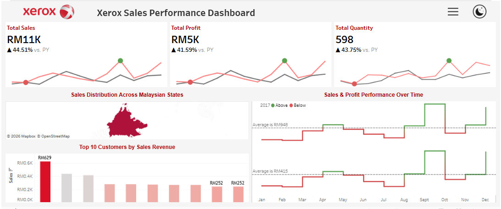
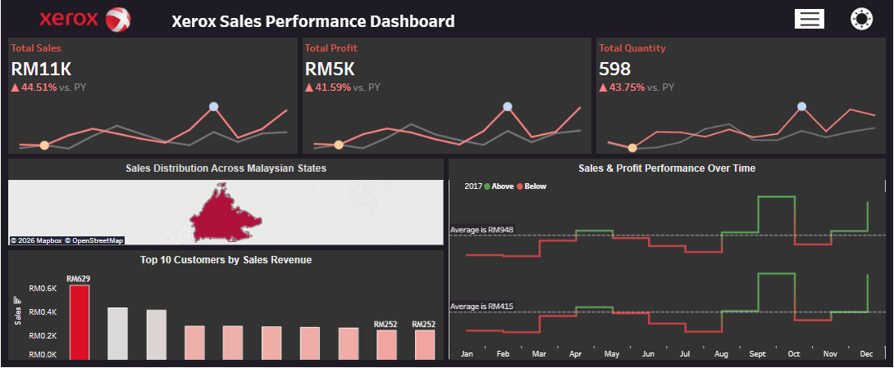

# Xerox Malaysia Sales Dashboard (2014–2017)

📊 An interactive Tableau dashboard analyzing sales performance across Malaysia, designed to highlight key business insights with a clean, user-friendly interface.

## Overview
This project explores **sales data from 2014–2017**, focusing on overall performance and customer behavior. The dashboard was built to support decision-making by combining **data analysis** with **visual storytelling**.

## Key Insights
- **Total Sales, Profit, and Quantity**: Summarized KPIs for quick performance tracking.
- **Sales Distribution by State**: Regional breakdown to identify high- and low-performing areas across Malaysia.
- **Sales & Profit Performance Over Time**: Time-series analysis to uncover seasonal trends and growth patterns.
- **Top 10 Customers by Sales Revenue**: Customer profiling to highlight key accounts driving revenue.

## Features
- 🔍 **Filter Functionality**: Interactive filters for product categories, regions, and time periods.
- 🌙 **Dark Mode Toggle**: Enhanced accessibility and user experience with light/dark mode options.
- 📈 **Dynamic Visuals**: Clear charts and maps for intuitive storytelling.

## Screenshots
### Light Mode

### Dark Mode

## Skills Highlighted
- Data Cleaning & Transformation  
- Tableau Dashboard Design  
- Business Intelligence & Storytelling  
- Customer Profiling & Trend Analysis  
- UI/UX Enhancements (filters, dark mode)

## Live Dashboard
👉 [View on Tableau Public](https://public.tableau.com/views/XeroxSalesPerformanceDashboard/XeroxSalesDashboard)
